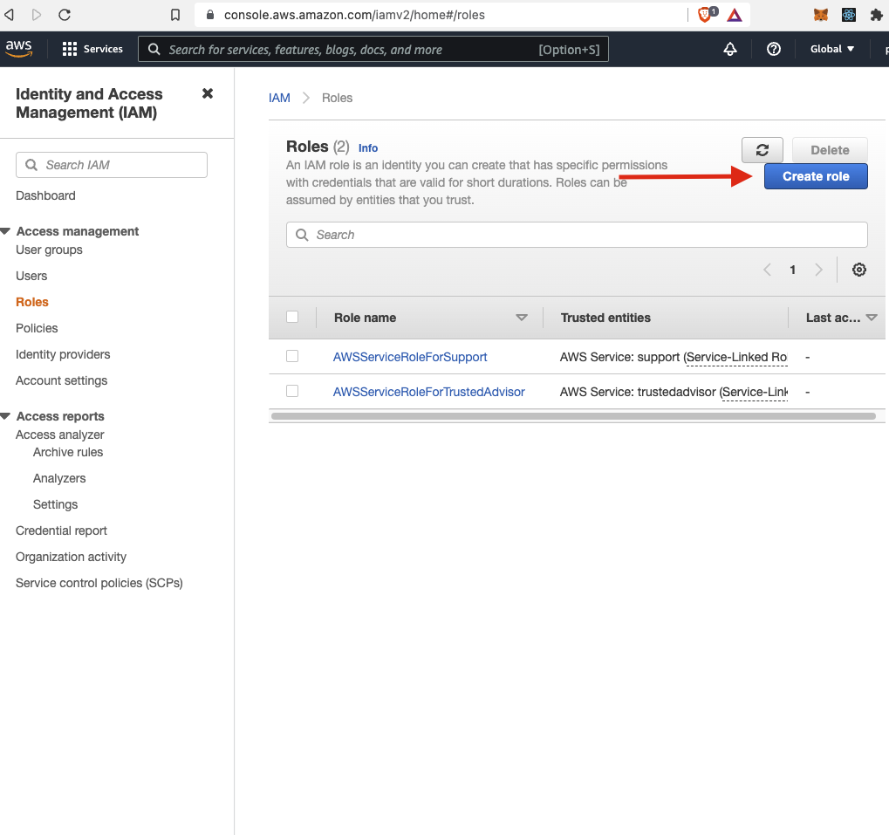
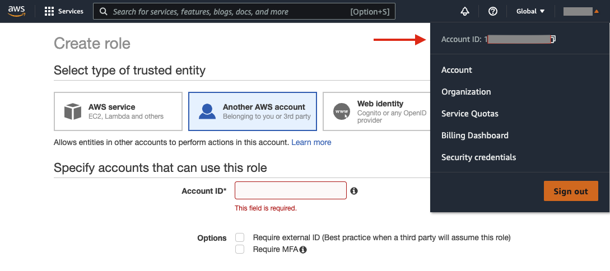
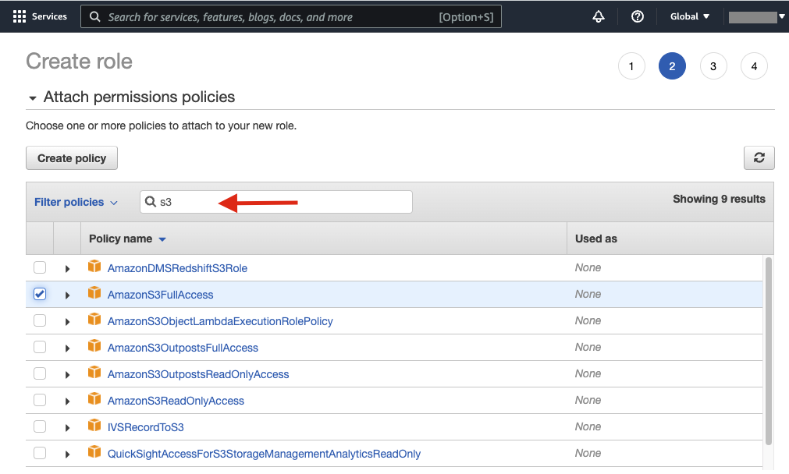
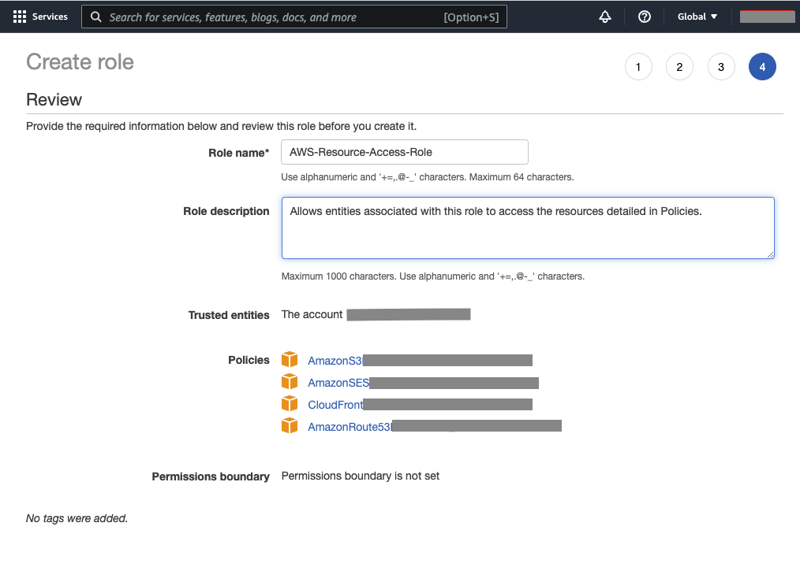
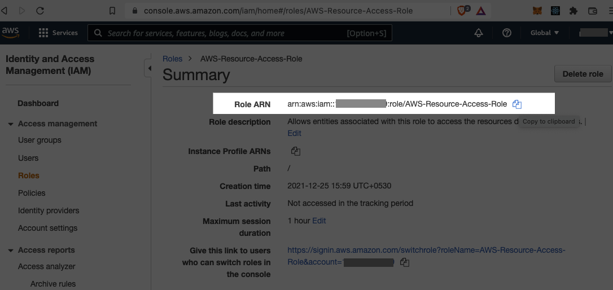

## Steps to create an AWS IAM role

On a web browser, navigate to the 'Roles' tab in the IAM Dashboard of the AWS Management Console: https://console.aws.amazon.com/iamv2/home#/roles

Click on the 'Create role' button

**NOTE:** If you do not see the 'Create role' button, log out of the console and log back in as a root user. 

Select 'Another AWS account' as the _Trusted Entity_ and enter your root user Account ID. You can find your Account ID by clicking on your profile on the top-right of the page:

The policies you choose on the next screen will determine the kinds of (AWS) resources your DShop can access. For example, the policy **AmazonS3FullAccess** will allow DShop to create and delete Amazon S3 buckets on your behalf. Search for the following keywords to find other supported services:
 - 'ses' (Amazon SES)
 - 'cloudfront' (AWS CloudFront)
 - 'route53' (Amazon Route 53) 

On the last screen, enter a name for the role and review your policy selections. Click on the 'Create role' button:

After you're redirected to the Roles page, click on the newly-created role and copy the Role ARN. This information will be used to allow DShop to interface with AWS by "assuming" the role. 

