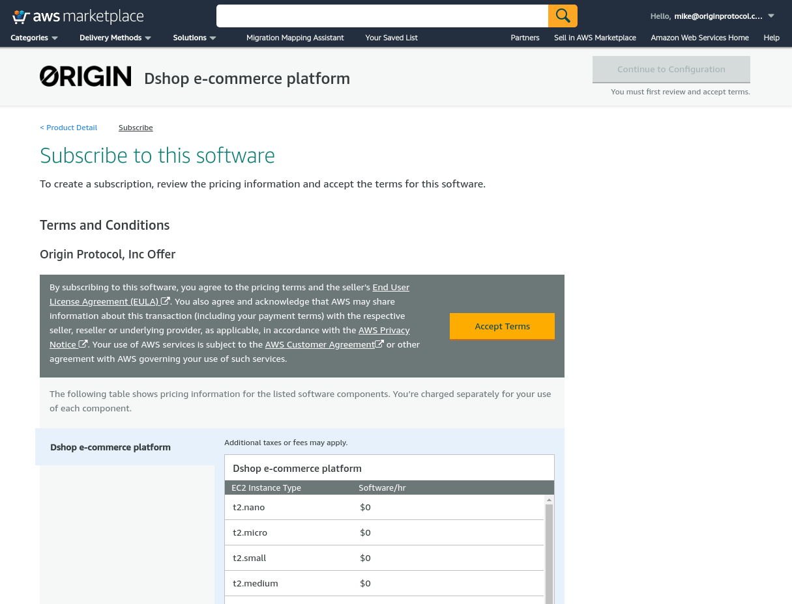
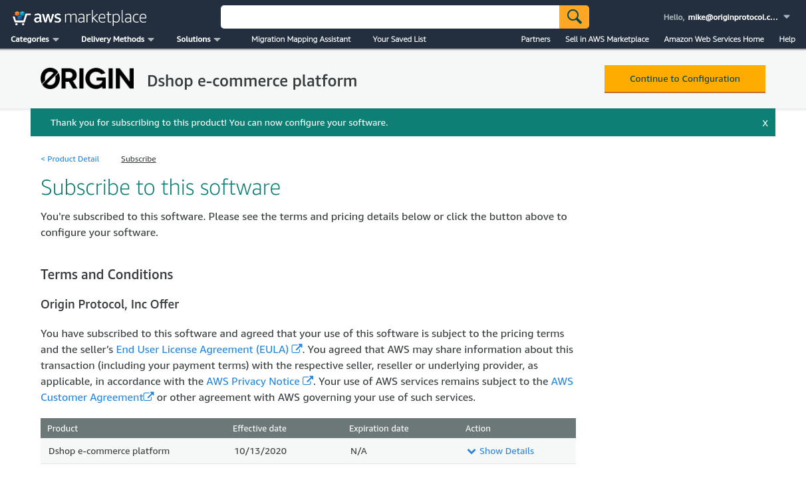
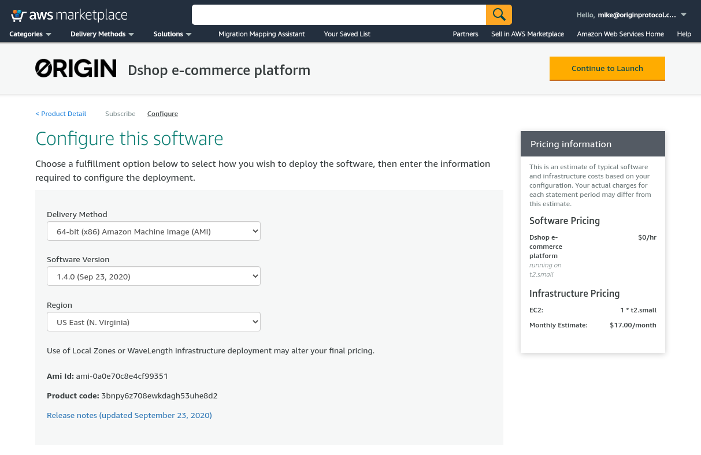
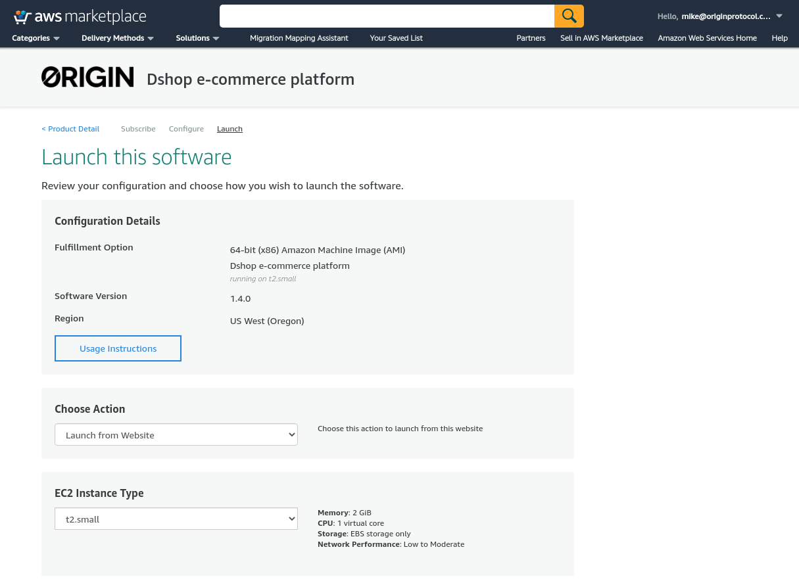
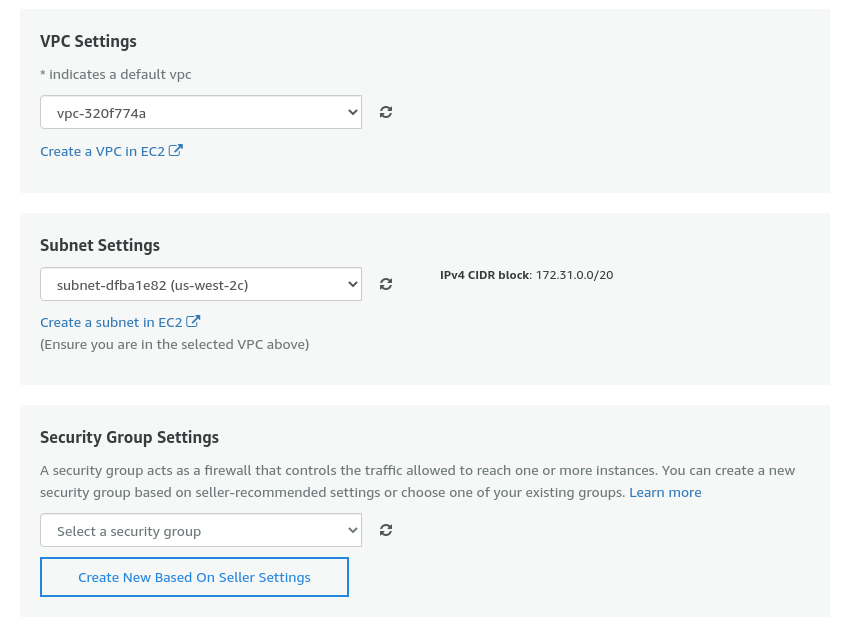
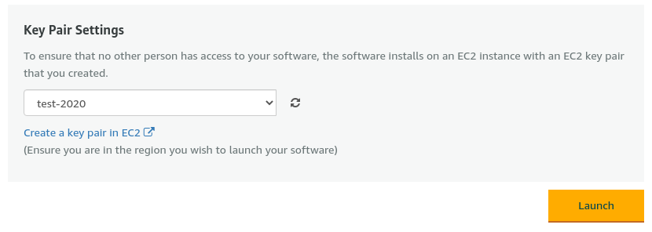
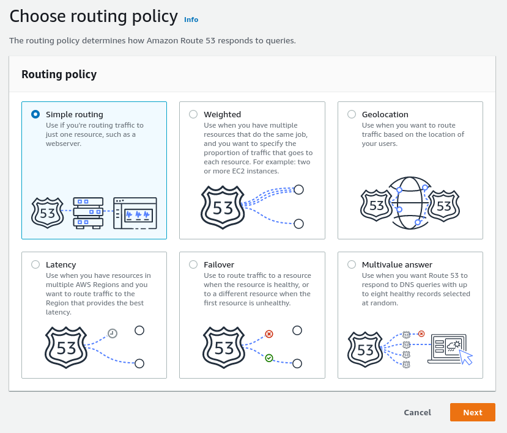
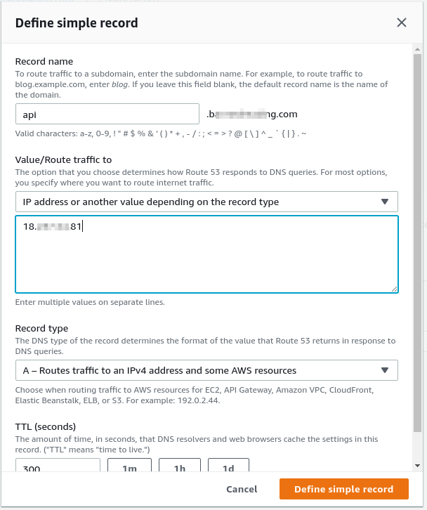
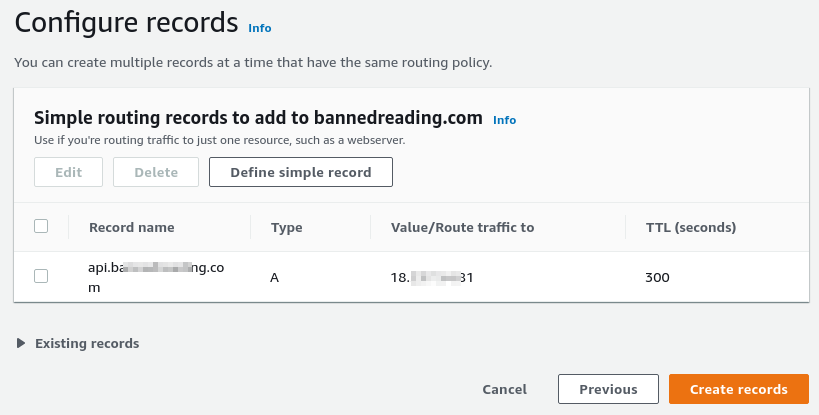

# Amazon Web Services (AWS)

**Note**:  If you have any questions, feel free to contact 
dshop@originprotocol.com.

## Deployment

Go to the Origin Protocol Dshop solution on the AWS marketplace.

Accept AWS Terms (if required).  This may take a few minutes to finish "subscribing."  When it's complete you'll see license effective date instead of "Pending."

Select Click "Continue to Configure"

Choose the version you would like to run(latest is best), and the region you
want to deploy to.

Click "Continue to Launch"

Choose your instance type.  We recommend at a bare minimum 1 GB of RAM and 10 GB
disk.  And make sure your security group has ports 80, and 443 open so you can
access the admin. 

Select network configuration(VPC and subnet), and if you would like to have SSH
access, select a security group with port 22 open.

Select or create an ssh keypair and click "Launch"

### Custom Domain

You should now configure DNS to work with your instance.  Using the IP address
assigned to your new instance, create a new A record pointing at this IP.

Select Simple Routing

Define your record.  We recommend something like `api.mydomain.com`.  You will
access the admin from here and your shops will make some requests to this as a
backend.  **This will not be the domain your customers use view your store.**

Click "Create records".  In a few minutes, you should now be able to access the
Dshop onboarding page by going to `https://api.mydomain.com` in your browser.

## First Run

You can now [configure your Dshop node](first-run.md).
