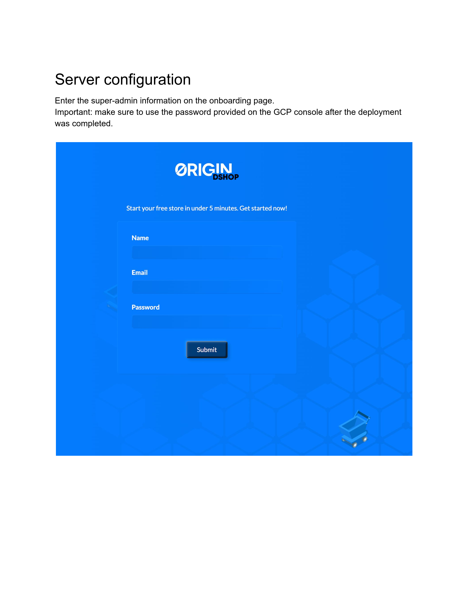
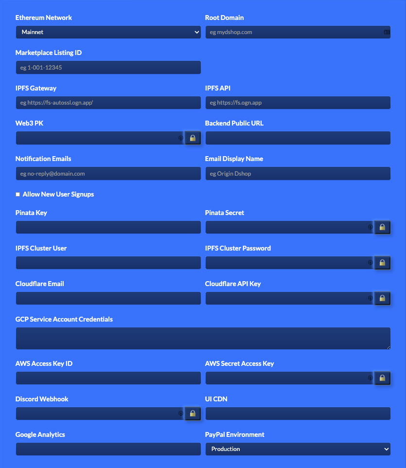

# First Run

After launching your new Dshop node you will need to configure it with your first super admin, and to talk to all the supporting services.

## Navigate

You configured DNS in the previous steps.  You should now be able to visit the node setup page at:

    https://<configured-domain>

Enter the super-admin information on the onboarding page. 

**IMPORTANT**: For GCP, make sure to use the password provided on the console after the deployment was completed.  For AWS, use the intstance ID.

Then configure the server:

Congratulations! You have successfully set up the Dshop deployer which allows you (and anyone you give access to) to launch and administer Dshops.

## Create your first shop

For details about creating and launching a Dshop, follow the steps described in this video: 

