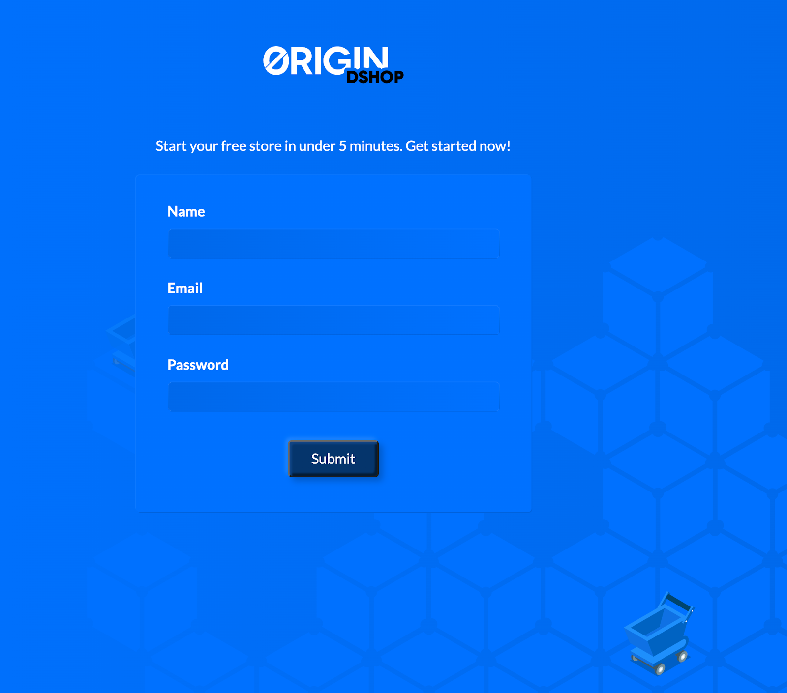

# First Run

After launching your new Dshop node you will need to configure it with your first super admin, and to talk to all the supporting services.

## Navigate

You configured DNS in the previous steps.  You should now be able to visit the node setup page at:

    https://<configured-domain>

Enter the super-admin information on the onboarding page. 

**IMPORTANT**: For GCP, make sure to use the password provided on the console after the deployment was completed.  For AWS, use the intstance ID.



## Configure the server


Use the following field entries as a guide to fill out this page:

- If you are a merchant running a DShop in a **production** environment: 
  - ```Ethereum Network```: Mainnet
  - ```Root Domain```: The Domain name associated with your shop.
  - ```Marketplace Listing ID```: This field has the format <chain_id>-<marketplace_contract_version>-<listing_seq>. Use 1-001-1 to set a _default_ value here.
  - ```IPFS Gateway``` and ```IPFS API```: These two fields are dependent on the IPFS provider used to host your shop data. For example, if you choose to go with Infura, the fields will take on https://ipfs.infura.io/ and https://ipfs.infura.io:5001/ as values. Contact DShop Support if you have questions. 
  - ```Web3 PK```: this is optional, you can leave empty
  - ```Notification Emails```: enter an email address
  - ```Email Display Name```: choose a name
  - ```Allow New User Signups```: don't forget to check that box otherwise you won't be able to create a shop

- If you are running DShop in a **development** environment: 
  - ```Ethereum Network```: Localhost
  - ```Root Domain```: localhost
  - ```Marketplace Listing ID```: 999-001-1
  - ```IPFS Gateway```: http://localhost:8080
  - ```IPFS API```: http://localhost:5002
  - ```Web3 PK```: this is optional, you can leave empty
  - ```Backend Public URL```: http://0.0.0.0:3000
  - ```Notification Emails```: enter an email address
  - ```Email Display Name```: choose a name
  - ```Allow New User Signups```: don't forget to check that box otherwise you won't be able to create a shop

Congratulations! You will now have successfully set up the Dshop deployer, which will allow you (and anyone you give access to) to launch and administer Dshops.

## Create your first shop

For details about creating and launching a Dshop, follow the steps described in this video: 

[](http://www.youtube.com/watch?v=UtajmQQ1Q-A)
