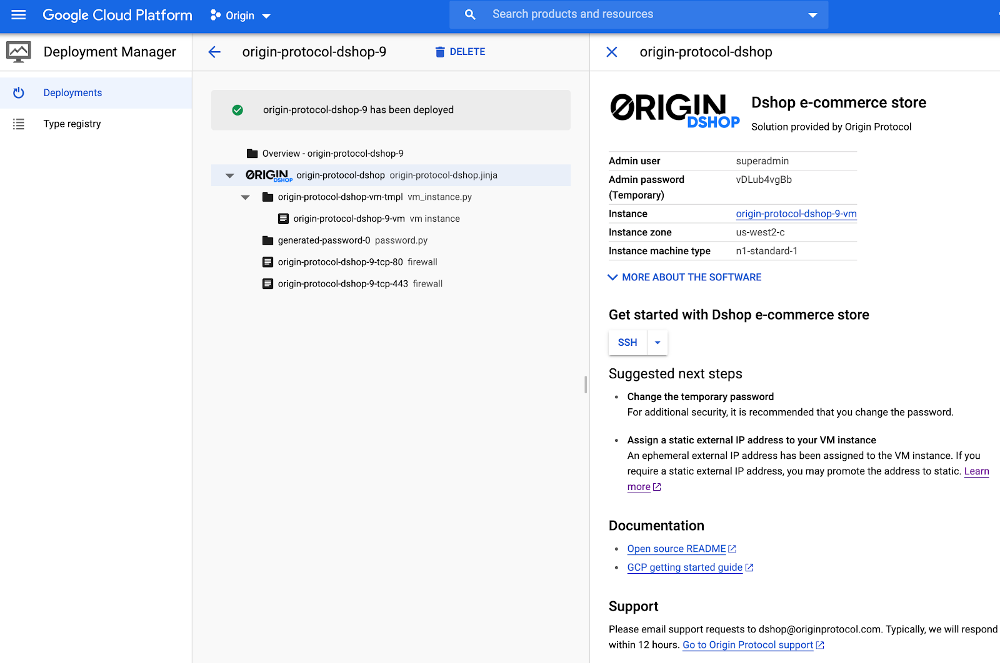
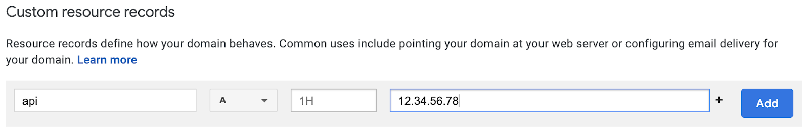

# Google Cloud Platform (GCP)

You can launch Dshop [directly from GCP marketplace](https://console.cloud.google.com/marketplace/details/originprotocol-public/origin-protocol-dshop).

### Notes

1) If you have any questions, feel free to contact dshop@originprotocol.com.
2) To be able to click on the URLs within this doc, rather than viewing it from your browser download it then use a pdf viewer.

## Deployment

Go to the [Origin Protocol Dshop solution on the GCP marketplace](https://console.cloud.google.com/marketplace/details/originprotocol-public/origin-protocol-dshop).

Click on the "LAUNCH" button at the top of the page.

It is recommended to use the default settings, but you can edit them if you'd like, for example to create the instance in a different zone or to use a different machine type. Do keep the firewall rules that allow HTTP and HTTPS traffic enabled. This is required for the Dshop admin UI and API to receive traffic.

For the solution to be functional, we recommend at a bare minimum 1 GB of RAM and 10 GB disk.

When you are done with editing the instance settings, click "Deploy"

Wait for the deployment to finish.

Once the deployment is complete, you should see a message that says "origin-protocol-dshop has been deployed".

Write down the Admin password that shows up on the right hand side of the panel. You will need it when creating the Dshop super-admin account.

The Dshop deployer should now be running on the GCP compute instance that was started. Click on the instance link on the top right of the page to access the details of the instance.

To check if Dshop has been deployed successfully to the instance, look for the external IP address assigned to the instance. Copy it to your lipboard, then in a browser, go to the URL: http://<IP address>. You should see the Dshop deployer's initial onboarding page for creating an admin account, confirming that the installation was successful.

Before you proceed with the server configuration, configure the instance following the instructions below to ensure the information you will be entering transits via a secure channel (HTTPS).

## Instance Configuration

### Static IP Address

For security purposes, it is advisable to reserve a static IP address for the compute instance running the Dshop stack rather than using an ephemeral one. Otherwise, if the instance gets restarted, the ephemeral IP may get assigned to somebody else's instance. 

You can do so by following [these instructions on reserving an IP address](https://cloud.google.com/compute/docs/ip-addresses/reserve-static-internal-ip-address).

### Custom Domain

The Dshop stack exposes a UI and APIs that must be accessed through secure HTTP (HTTPS). In order for HTTPS to get set up, you need to have a custom domain pointing to the external IP of the GCP compute instance. You can do so by using a domain registrar such as https://domains.google or equivalent.

As an example, here are the steps to use on Google Domains:

1) Login to https://domains.google
2) Either get a new domain or click on an existing one you already own.
3) In the left menu for your domain, click on “DNS”
4) Look for the "custom resource records" section on the DNS page
5) Add a record of type A pointing to the IP of the instance. For example, if your domain is "myDshop.com", you could add a record "api" of type A pointing to the IP address of the instance. The Dshop APIs and admin UI would then be accessible via https://api.myDshop.com

Wait a few minutes for the domain change to propagate. The SSL certificate will get created automatically on the instance.

You should now be able to access the Dshop onboarding page by going to https://<your domain> in your browser.

## First Run

You can now [configure your Dshop node](first-run.md).
