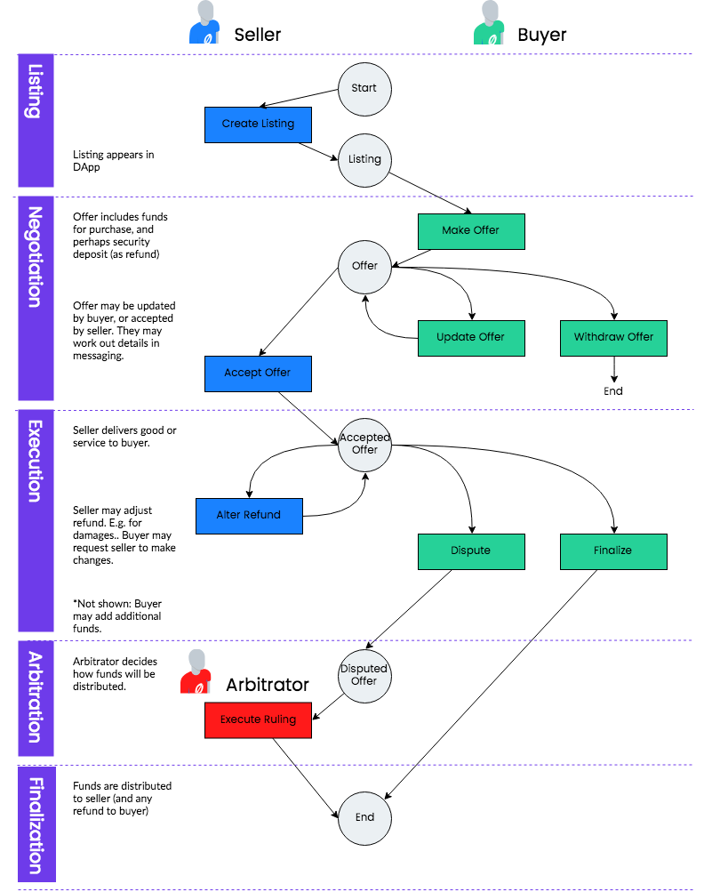

# Disputes

One of the primary challenges of a successful marketplace is effectively
managing disputes. Today, credit card companies offer buyers protection in the
form of charge backs. If a buyer complains about a problem with their purchase,
they will usually receive a refund from their credit card company who will pass
the expense on to the merchant.

In the blockchain world, a 'charge back' is not possible. Instead, we must use
an escrow system, whereby a mutually agreed arbitrator will rule on any dispute
between buyer and seller and decide on the distribution of funds. The escrow
system works as follows:

1. Buyer makes an offer on a seller's goods or services by sending funds into
   escrow.
2. Seller agrees to fulfill buyer's order by accepting their offer.
3. Buyer releases funds to the seller once they are happy with their purchase.

Now let's look at all the things that could go wrong with this process.

**What if the seller is unresponsive after the buyer makes an offer?**
The buyer is able to withdraw their offer and receive a full refund, so long as
the seller has not yet accepted the offer.

**What if the buyer fails to release the funds once they receive their
order?**
When the buyer makes their offer, they specify a reasonable window of time in
which a dispute can be opened. Only the buyer can release funds before the
dispute window has passed, but once it has passed, the seller is able to
retrieve their funds without input from the buyer. The dispute window should be
long enough to allow the buyer to evaluate their purchase. For example, for
shipped goods it could be set to the delivery date + 3 days.

**What if the buyer is not happy and wants a refund?**
If the dispute window has not passed, the buyer is able to raise a dispute.
Doing so will pass control of the escrowed funds to a mutually agreed upon
arbitrator, who will accept evidence from both buyer and seller and rule on how
funds should be distributed.

**How are the arbitrator and dispute window agreed upon?**
The seller may indicate acceptable arbitrators and dispute windows as part of
their listing data. However it is the buyer who submits the parameters to the
smart contract when they make their offer. The seller can then choose whether to
accept the offer or not.

### Marketplace Flow

